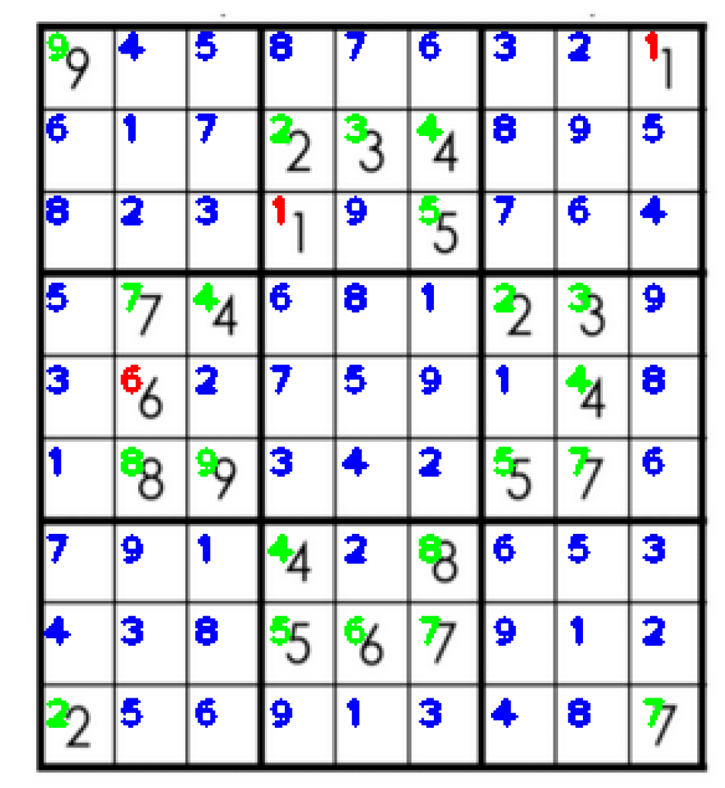
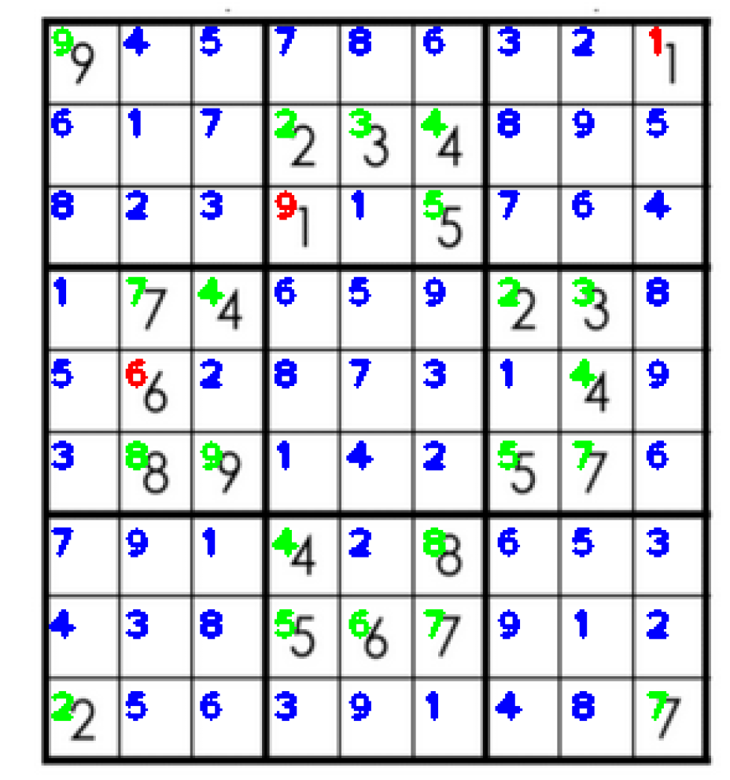

# Sudoku Solver

Tiny program that solves Sudoko that it sees on the image. It comprises of 3 main steps:
1. Recongize the sudoku grid:
    - solved with openCV's findContour() and then picking the big square that has at least 4 smaller squares inside it that are valid for Sudoku
1. Get each digit from Sudoku grid: 
    - split the big square into 81 cells and for each cell remove edges, 
    - discard if nothing inside, otherwise center around center of mass (here: digit)
    - enlarge the digit
1. Recognize the digit:
    - simple CNN with 2 conv layers and 2 fully-connected
    - pick top 3
    - if the first has prob > 80%, discard other 2 options, otherwise consider all 3 options
1. Solve Sudoku puzzle:
    - discard all invalid starting puzzles
    - solve others with depth-first search algorithm
    - discard all that don't have solution
1. Overlay infered digits and fill in the blank cells

**ATTENTION: this is MVP version, meaning that each part works, but there is still lots of space for improvement.**

### Example 

Green is a recognized digit with high confidence, red with low confidence, blue are filled gaps.

Correct example:

Same example but with incorrect output: the model flasly classifed 1 as 9, and such puzzle was still validly solved.

### Requirements:
Inside of this folder the following is necessary:
1. `mnist/` with unzipped files from [Yann Lecun's site](http://yann.lecun.com/exdb/mnist/)
2. `model.pt` trained MNIST model that can be trained by uncommenting a line in main.cpp

### How to build
1. `mkdir build`
1. `cd build`
1. `cmake ..`
1. `cmake --build .`

### Example run:
from build folder: `./SudokuSolver ../data/sudoku10.png`